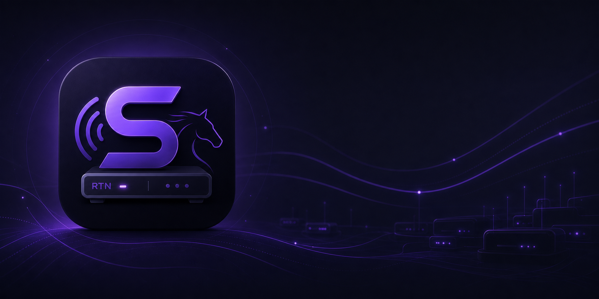

<p align="center">
  
</p>

<h1 align="center">Simulcast Utility Suite</h1>

<p align="center">
  <strong>A modern, asynchronous Windows application for discovering, monitoring, configuring, and controlling RTN simulcast receivers.</strong>
</p>

<p align="center">
  <a href="https://dotnet.microsoft.com/"></a>
  <a href="https://learn.microsoft.com/dotnet/desktop/wpf/"></a>
  
</p>

<p align="center">
  <a href="LICENSE"></a>
  <a href="https://github.com/NyxionSoftware/SimulcastUtilitySuite/stargazers"></a>
  <a href="https://github.com/NyxionSoftware/SimulcastUtilitySuite/issues"></a>
  <a href="https://github.com/NyxionSoftware/SimulcastUtilitySuite/releases"></a>
</p>

---

> [!WARNING]
> **Work in progress**
>
> Simulcast Utility Suite is under active development and has not reached a stable public release. Features, the interface, and especially the plugin framework may evolve as the project grows.

---

# 📖 Overview

**Simulcast Utility Suite** is a modern WPF desktop application for discovering, monitoring, configuring, and controlling **RTN** simulcast receivers from one responsive interface.

**RTN (Racetrack Television Network)** delivers live racing and simulcast content to racetracks, casinos, sportsbooks, and off-track betting facilities throughout North America. Simulcast Utility Suite provides a modern receiver-management experience focused on responsiveness, clear live status, and extensibility.

Receiver communication and long-running operations use an asynchronous architecture so the interface remains responsive. A central receiver manager acts as the source of truth for selection, configuration, connection state, activity, channel information, and plugin integrations.

The application has grown beyond basic receiver control into an extensible platform. Plugins can add interface elements, commands, schedules, media feeds, themes, settings, persistent data, and application behavior without modifying the core application.

---

# 📥 Download

Once public builds are available, the latest installer will be published on the GitHub Releases page.

<p align="center">
  <a href="https://github.com/NyxionSoftware/SimulcastUtilitySuite/releases/latest"><strong>➜ Download the latest release</strong></a>
</p>

The self-contained Windows x64 installer does not require users to install the .NET runtime separately. Setup supports both per-user and workstation-wide installations.

---

# 📷 Application Showcase

## Main Dashboard

Monitor receiver status, activity, channel information, EPG progress, and receiver details while keeping channel controls and actions close at hand.

<!-- Add:  -->

> 📸 A current dashboard screenshot will be added before release.

---

## Receiver Management

Discover, validate, add, edit, delete, and fluidly reorder receivers without leaving the main application shell.

<!-- Add:  -->

> 📸 A current receiver-management screenshot will be added before release.

---

## Plugin Management

Import, enable, disable, refresh, configure, and actively unload plugins at runtime. Plugin-defined settings are presented using controls that match the application theme.

<!-- Add:  -->

> 📸 A current plugin-management screenshot will be added before release.

---

## Virtual Remote

Open one independent, non-modal virtual remote per receiver and continue working in the main window while commands are sent.

<!-- Add:  -->

> 📸 A current virtual-remote screenshot will be added before release.

See the [screenshot guide](docs/assets/screenshots/README.md) for the prepared filenames and capture guidance.

---

# ✨ Features

- ⚡ Asynchronous receiver discovery, communication, and refresh operations
- 📡 Live online, offline, warning, editing, transmitting, and idle activity states
- 📺 Current channel, EPG information, event times, and live progress display
- 🎛 Validated channel control with command throttling and visual feedback
- 🎲 Plugin-powered channel discovery actions such as **Feeling Lucky**
- ⚙ Add, edit, delete, validate, and fluidly reorder receiver configurations
- 🕹 Independent virtual remote windows with live activity feedback
- 🔔 Animated, stacked success, information, and error notifications
- 🔄 Immediate startup refresh and guarded per-receiver or refresh-all actions
- 🧩 Runtime plugin importing, enabling, disabling, refreshing, and removal
- 🎨 Plugin-provided application themes, including title-bar appearance
- 💾 Persistent receiver configuration and plugin-specific data storage
- 📦 Styled per-user and workstation-wide installers with optional receiver import

---

# 🖥 Main Dashboard

The dashboard provides quick access to the selected receiver and its controls:

- Receiver name, identifier, IP address, MAC address, and software version
- Online status, last-seen time, and current receiver activity
- Current channel, event information, start and end times, and progress
- Validated channel entry and plugin-provided channel actions
- Refresh, edit, virtual remote, and other receiver actions
- Plugin-provided cards, controls, schedules, and media experiences

Receiver selection is synchronized through the receiver manager, ensuring every view and open virtual remote reflects the current receiver information.

---

# 🔌 Plugin Framework

Plugins implement `ISimulcastPlugin` from `SimulcastUtility.Plugins` and receive an `IPluginContext` during initialization. Plugins can be imported as a single DLL, a collection of DLLs, or a ZIP package.

## Plugins can currently

- 📋 Access and observe the receiver collection and selected receiver
- 📡 Dispatch receiver commands through the application's command services
- 🖥 Locate and extend application views with custom WPF elements
- 💬 Open application dialogs and publish themed notifications
- 🎨 Register themes and control light or dark title-bar appearance
- 💾 Store plugin-specific data through the application data-store API
- ⚙ Expose named settings, descriptions, choices, toggles, and list selectors
- 🧭 Handle application startup arguments
- 🔔 Subscribe to receiver and application events
- ♻ Enable, disable, refresh, unload, and remove plugin code at runtime

## Plugin settings controls

The built-in settings experience currently supports:

- Text
- Numeric
- Toggle
- Checkbox
- MultiCheckbox
- Dropdown (choice)
- SideBySideList

## Plugin folder layout

Plugins may be placed directly inside the configured plugin directory or in their own subdirectory when dependencies are required.

```text
Plugins/
├── ExamplePlugin.dll
├── RTNSchedulePlugin/
│   ├── RTNSchedulePlugin.dll
│   └── PluginDependency.dll
└── FeedPlugin/
    ├── FeedPlugin.dll
    └── MediaDependency.dll
```

The application recursively discovers compatible plugins. Shared Simulcast Utility contract assemblies should not be copied into an individual plugin directory.

For complete guidance, see the [Plugin Development Wiki](docs/wiki/Plugin-Development.md).

---

# 🚀 Getting Started

## End-user requirements

- Windows 10 version 1809 or newer
- Windows 11
- 64-bit Windows installation

The official installer publishes a self-contained application, so no separate .NET installation is required.

## Build requirements

- .NET 10 SDK
- Visual Studio 2026 or another IDE with WPF support
- Inno Setup 6 when building the installer

Clone and build the project:

```powershell
git clone https://github.com/NyxionSoftware/SimulcastUtilitySuite.git
cd SimulcastUtilitySuite
dotnet restore
dotnet build SimulcastUtilitySuite.slnx
dotnet run --project SimulcastUtility\SimulcastUtility.csproj
```

---

# 📦 Building the Installer

Run the installer builder from the repository root:

```bat
Installer\build-installer.cmd
```

An optional version can be supplied as the first argument:

```bat
Installer\build-installer.cmd 1.0.0
```

The generated installer is written to `Installer\Output\SimulcastUtilitySetup.exe` and lets the user choose between:

- A per-user installation under `%LOCALAPPDATA%\Programs` without elevation
- A workstation installation under `%ProgramFiles%\NyxionSoftware` with administrator approval

The installer can optionally import an existing `receivers.json`. The themed uninstaller independently offers removal of receiver configuration, installed plugins, and plugin data.

---

# ⚙ Configuration and Application Data

Unless overridden through configuration, application data is stored under:

```text
%LOCALAPPDATA%\SimulcastUtility
```

| Data | Default location |
| --- | --- |
| Receiver configuration | `receivers.json` |
| Logs | `Logs\` |
| Installed plugins | `Plugins\` |
| Plugin data and settings | `PluginData\` |

Logging and plugin directories can be changed through application configuration. The uninstaller preserves application data unless the user explicitly selects a cleanup option.

---

# 🧱 Solution Structure

| Project | Responsibility |
| --- | --- |
| `SimulcastUtility` | WPF executable, startup, and application windows |
| `SimulcastUtility.Wpf` | Views, view models, controls, themes, and WPF plugin services |
| `SimulcastUtility.Application` | Receiver workflows, commands, events, and application interfaces |
| `SimulcastUtility.Core` | Receiver models, enums, exceptions, and shared domain logic |
| `SimulcastUtility.Infrastructure` | Receiver persistence and infrastructure services |
| `SimulcastUtility.Configuration` | Application configuration models |
| `SimulcastUtility.Logging` | Logging infrastructure |
| `SimulcastUtility.Plugins` | Plugin contracts, loading, settings, storage, and runtime management |
| `Installer` | Inno Setup source, generated payload, and installer builder |

---

# 🛣 Roadmap

- [x] Manual receiver discovery and validation
- [x] Receiver channel control and virtual remote
- [x] Receiver configuration, deletion, and drag-to-reorder
- [x] Live receiver status, activity, EPG, and progress
- [x] Animated application notifications
- [x] Runtime plugin management and active unloading
- [x] Plugin settings and persistent data-store APIs
- [x] Application-wide plugin themes
- [x] Styled per-user and workstation installer
- [ ] Automatic receiver discovery
- [ ] Receiver group management
- [ ] Multi-language support
- [ ] Server-mode statistics and monitoring

---

# 📚 Documentation

The local [GitHub Wiki source](docs/wiki/Home.md) covers application usage, receiver management, configuration, plugin installation, plugin development, settings, data storage, UI integration, and themes.

- [Getting Started](docs/wiki/Getting-Started.md)
- [Managing Receivers](docs/wiki/Managing-Receivers.md)
- [Managing Plugins](docs/wiki/Managing-Plugins.md)
- [Creating Your First Plugin](docs/wiki/Creating-Your-First-Plugin.md)
- [Building and Distributing Plugins](docs/wiki/Building-and-Distributing-Plugins.md)
- [Plugin Settings and Data](docs/wiki/Plugin-Settings-and-Data.md)
- [Plugin UI, Notifications, and Themes](docs/wiki/Plugin-UI-Notifications-and-Themes.md)
- [Virtual Remote](docs/wiki/Virtual-Remote.md)
- [Application Data and Troubleshooting](docs/wiki/Application-Data-and-Troubleshooting.md)

---

# 🤝 Contributing

Contributions, bug reports, feature requests, documentation improvements, and example plugins are welcome.

1. Fork the repository.
2. Create a focused feature branch.
3. Commit and test your changes.
4. Open a pull request describing the change.

The `main` branch contains the current application. The `legacy` branch preserves the previous implementation.

---

# 📄 License

Simulcast Utility Suite is available under the [MIT License](LICENSE).

---

<p align="center">
  Made with 💜 by <strong>Nyxion Software</strong>
</p>
